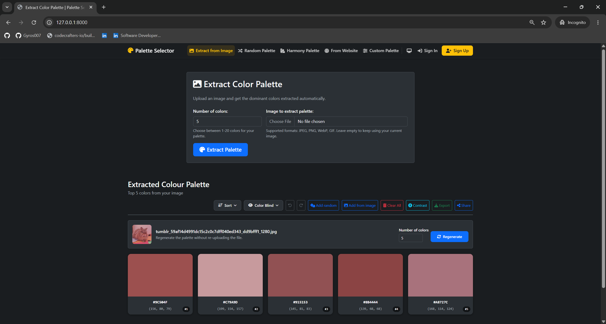
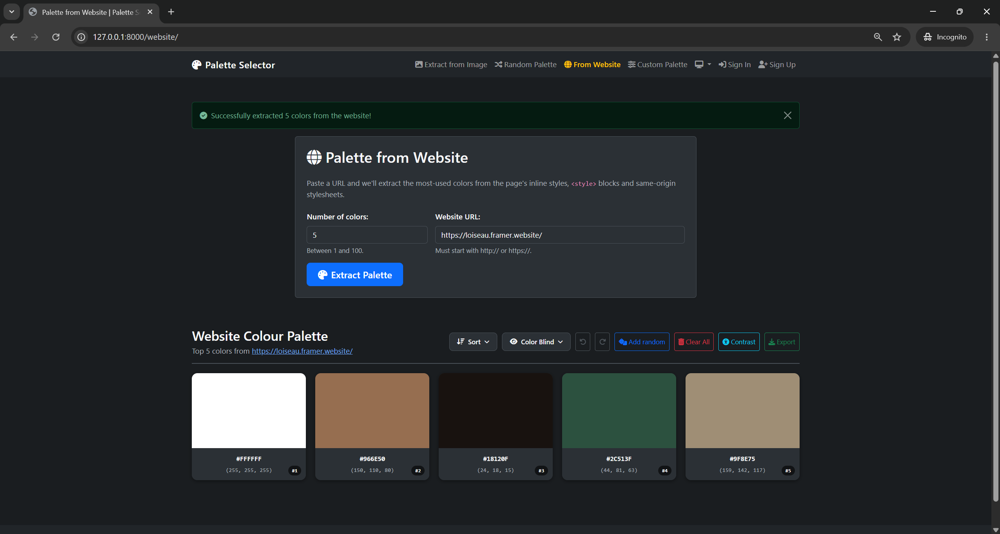
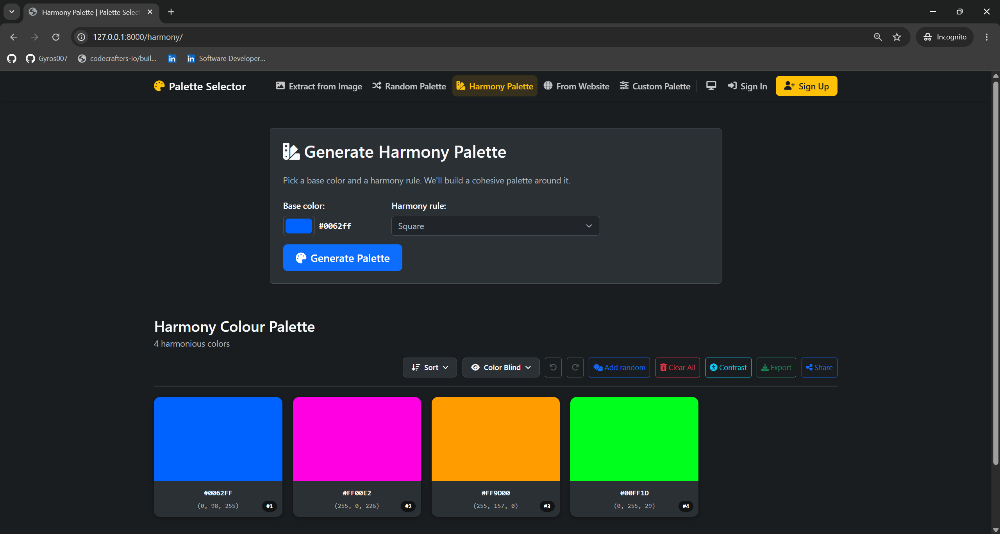
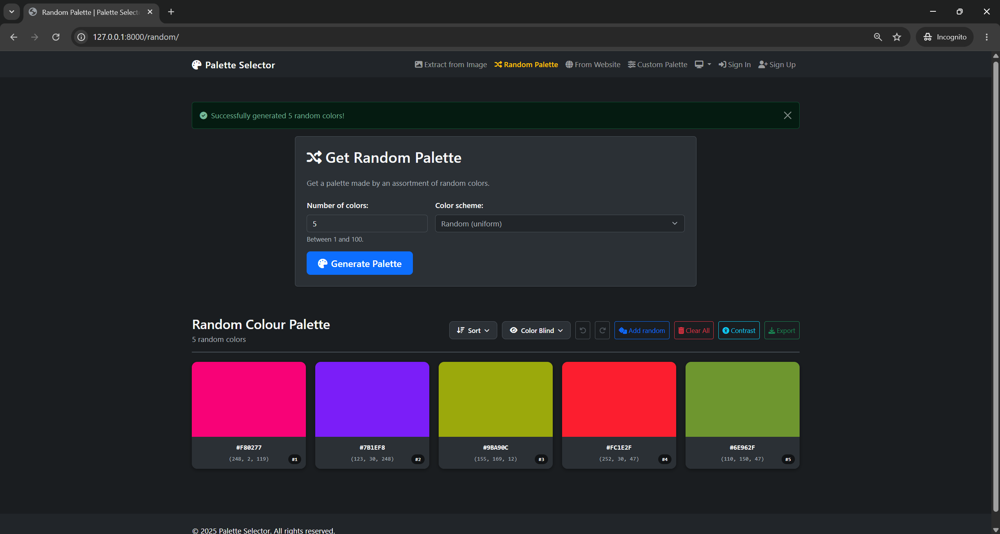
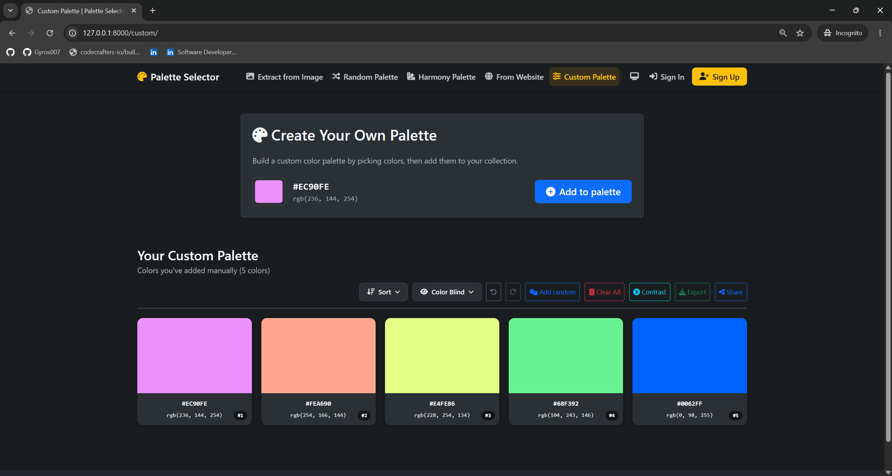
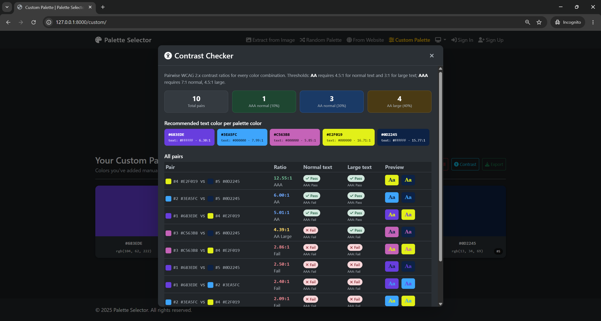

# Palette Selector

> The full source code lives in a private repository. This repo exists to share the project's scope, design decisions, and screenshots with recruiters and hiring managers.

## Tech stack

## Screenshots

<!-- Replace with real captures: see screenshots/README.md for the suggested shot list. -->

| Image extraction | Website extraction |
| --- | --- |
|  |  |

| Harmony generator | Random palette (25 curated moods) |
| --- | --- |
|  |  |

| Custom palette | Contrast checker |
| --- | --- |
|  |  |

## Features

- **Five palette generators**
  - **Image** — upload any image; dominant colors are extracted via Pillow's median-cut quantization. RGBA inputs are flattened against white so transparency doesn't bias the palette toward black.
  - **Website** — paste a URL; the live page is rendered in headless Chromium (Playwright), screenshotted, then fed through the image pipeline so the palette reflects what users actually see — applied CSS, dark-mode rules, and lazy-loaded imagery — not unused stylesheet tokens.
  - **Harmony** — pick a base color and generate a palette from classic color-theory relationships: complementary, analogous, triadic, split-complementary, tetradic, and square, plus monochromatic / shades / tints / tones ramps.
  - **Random** — 25 curated "moods" (pastel, neon, ocean, sunset, cyberpunk, matcha, midnight, …) defined as HSL hue/saturation/lightness windows for predictable aesthetics, plus a pure-random mode.
  - **Custom** — a JS canvas for hand-picking colors; doubles as the editor for any saved palette.
- **Lock-and-regenerate** — pin any colors in the palette and regenerate the rest around them, preserving positions.
- **Shareable links** — every palette can be encoded directly in the URL (`/p/ff0000-00ff00/`), so a link works with no saved record, never expires, and is identical whether it came from a generator or a saved palette.
- **Saved palettes** — signed-in users can save palettes and organize them in a file-explorer-style tree of nested folders, with breadcrumbs, tags, and search across name and tags. Palettes can be renamed, moved between folders, re-edited, and deleted.
- **Accessibility**
  - WCAG contrast checker built into the palette.
  - Colorblind simulation overlay (protanopia / deuteranopia / tritanopia).
- **Color tools** — blend between two palette colors; sort by hue, lightness, frequency, or RGB channel.
- **Accounts** — sign up, manage email/password, delete account, and choose a light/dark/system theme stored as a server-side preference for signed-in users with a cookie fallback for guests.
- **Defensive** — the website extractor rejects non-`http(s)` URLs and hostnames that resolve to private, loopback, link-local, multicast, or reserved addresses (SSRF guard).
